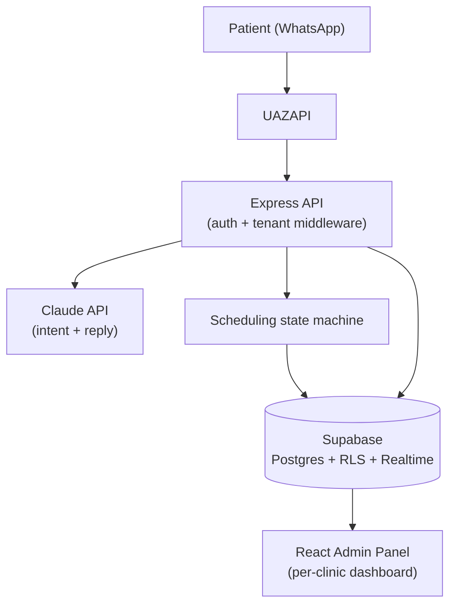

# KlivIA

**AI-powered WhatsApp Reception Platform for Healthcare Clinics**

## Key Features

- ✅ Multi-tenant SaaS with true Postgres Row-Level Security
- ✅ AI-powered WhatsApp receptionist
- ✅ Self-service appointment scheduling
- ✅ Automated reminders and patient-initiated cancellation
- ✅ Medical records per appointment
- ✅ Internal CRM
- ✅ Role-based authorization (platform role + per-clinic role)

> This repository showcases the architecture and engineering decisions behind a production healthcare SaaS. Sensitive business logic, AI prompts, and customer data remain private in the main repos (`klivia-admin`, `klivia-api`).

## The problem

Small and mid-size clinics can't staff 24h reception, and lose patients who give up waiting for a WhatsApp reply. Hiring more front-desk staff doesn't scale with message volume.

## Architecture

## What it does

### AI Reception
Understands patient intent (question, scheduling, cancellation) over WhatsApp and replies automatically; escalates to a human attendant when needed.

### Scheduling
Self-service booking inside the chat — the bot computes real open slots, crossing professional availability, lunch/break windows and already-booked appointments, and confirms without staff involvement.

### Reminders & Cancellation
Automated day-before reminders and patient-initiated cancellation, both over WhatsApp.

### Medical Records
Anamnesis, procedure and notes linked to each appointment and to the patient's history.

### CRM
Conversation history, internal notes, staff assignment per lead/case.

### Multi-tenancy
One deployment serves several clinics. Each one only ever sees its own data — enforced by Postgres Row-Level Security, not just a screen-level filter.

### Admin Panel
Schedule, staff, working hours, configuration and guided onboarding, per clinic.

## Highlights

- Production deployment (DigitalOcean, PM2, Nginx)
- Modular backend, REST API
- Multi-tenant architecture with Postgres Row-Level Security
- Role-based authorization
- AI orchestration (Claude API)
- Event-driven conversation workflow that survives a server restart mid-conversation
- WhatsApp automation (UAZAPI)

## Stack

| Layer          | Technology                                              |
|----------------|----------------------------------------------------------|
| Backend        | Node.js, TypeScript, Express                              |
| Database       | Supabase (Postgres + Row-Level Security + Realtime)       |
| AI             | Claude API (Anthropic)                                    |
| Messaging      | UAZAPI (WhatsApp gateway)                                  |
| Frontend       | React, TypeScript, Vite                                    |
| Infrastructure | DigitalOcean, PM2, Nginx                                    |

## Code Examples

Representative excerpts from the production codebase:

- [`examples/tenant-security.ts`](./examples/tenant-security.ts) — backend auth/authorization middleware: validates the Supabase session and restricts every route by platform role and by clinic.
- [`examples/appointment-state-machine.ts`](./examples/appointment-state-machine.ts) — WhatsApp scheduling bot: computes real availability (crossing schedule, breaks and existing bookings), drives the conversation through steps to confirmation, and persists its state (survives a server restart mid-conversation).

## Contact

Ricardo — Software Engineer since 2004, currently focused on AI agents, backend architecture, SaaS platforms and automation.

[rishinaka.work@gmail.com](mailto:rishinaka.work@gmail.com) · [github.com/rishinaka](https://github.com/rishinaka)
